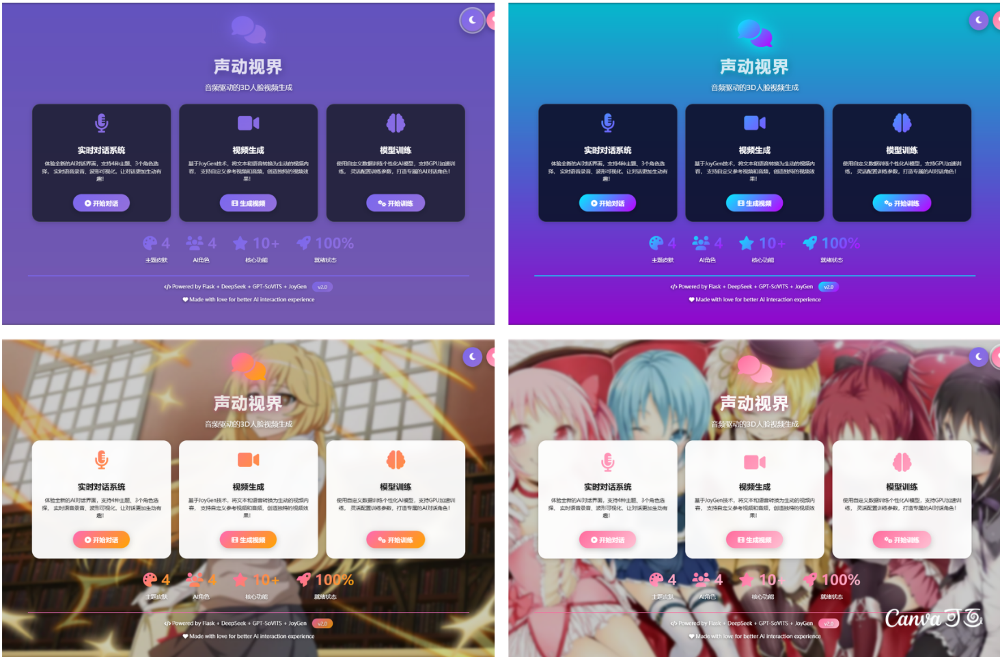

# CSV 数字人视频生成系统

> 一个集成了语音合成（TTS）、数字人视频生成（JoyGen）、AI对话的完整数字人解决方案。



## 功能特性

- 🎤 **语音合成（TTS）** - 基于 GPT-SoVITS 的高质量语音合成
- 🎬 **数字人视频生成** - 基于 JoyGen 的唇形同步视频生成
- 💬 **AI 对话系统** - 集成 OpenAI API 的智能对话
- 🎨 **多主题皮肤** - 支持多种界面风格切换

## 系统要求

- Python 3.10+
- Docker（用于 JoyGen）
- NVIDIA GPU（推荐 16GB+ 显存）
- CUDA 11.8+

## 安装依赖

### Python 依赖

```bash
pip install -r requirements.txt
```

**依赖列表：**
- Flask==3.0.3
- SpeechRecognition
- openai>=1.0.0
- requests
- pydub
- werkzeug

### 外部组件

1. **GPT-SoVITS** - 语音合成引擎
   - 下载地址：[GPT-SoVITS-v2pro](https://www.modelscope.cn/models/FlowerCry/gpt-sovits-7z-pacakges/resolve/master/GPT-SoVITS-v2pro-20250604.7z)
   - 解压到 `GPT-SoVITS-v2pro/` 目录

2. **JoyGen** - 数字人视频生成
   - 放置于 `JoyGen/` 目录
   - 需要 Docker 镜像 `joygen:v1.0`
   - 预训练模型下载：[JoyGen Pretrained Models](https://drive.google.com/file/d/1kvGsljFRnXKUK_ETdd49jJy8DbdgZKkE/edit)
   - 解压到 `JoyGen/pretrained_models/` 目录

## 快速启动

```bash
# 启动服务
python app.py

# 或使用批处理脚本
start_server.bat
```

服务启动后访问：http://localhost:5000

## 项目结构

```
csv_front/
├── app.py                 # 主程序入口
├── backend/               # 后端模块
│   ├── chat_engine.py     # AI 对话引擎
│   ├── tts_service.py     # TTS 服务
│   ├── video_generator.py # 视频生成
│   └── model_trainer.py   # 模型训练
├── templates/             # HTML 模板
├── static/                # 静态资源
├── config/                # 配置文件
├── GPT-SoVITS-v2pro/      # TTS 引擎（需单独下载）
└── JoyGen/                # 视频生成引擎
    ├── run_joygen.sh      # Docker 调用脚本
    ├── pretrained_models/ # 预训练模型（需单独下载）
    ├── checkpoints/       # 训练模型
    └── results/           # 生成结果
```

## 使用说明

### 1. 对话系统
访问首页，与 AI 进行对话，支持语音输入和输出。

### 2. 视频生成
上传音频和参考视频，生成唇形同步的数字人视频。

### 3. 模型训练
上传训练视频，训练个性化的数字人模型。

## 许可证

本项目基于原 [TFG_ui](https://github.com/原作者/TFG_ui) 项目重构开发。

## 致谢

- [GPT-SoVITS](https://github.com/RVC-Boss/GPT-SoVITS)
- [JoyGen](https://github.com/原作者/JoyGen)
